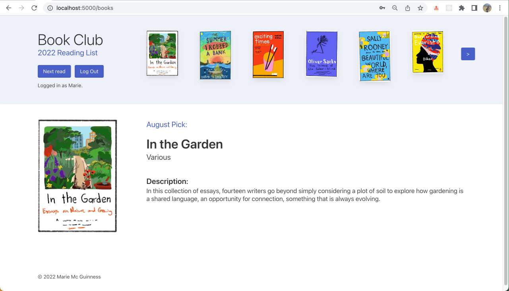
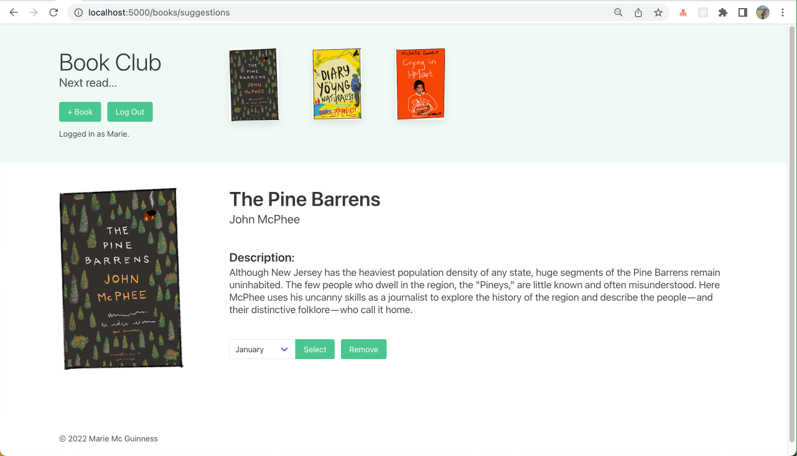
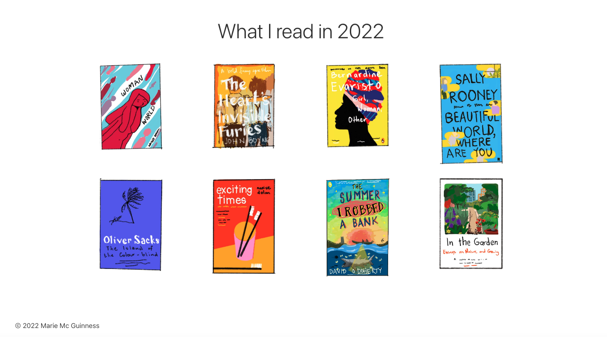
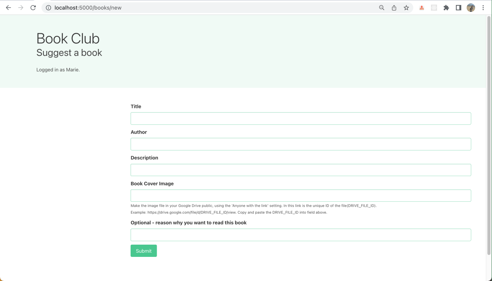
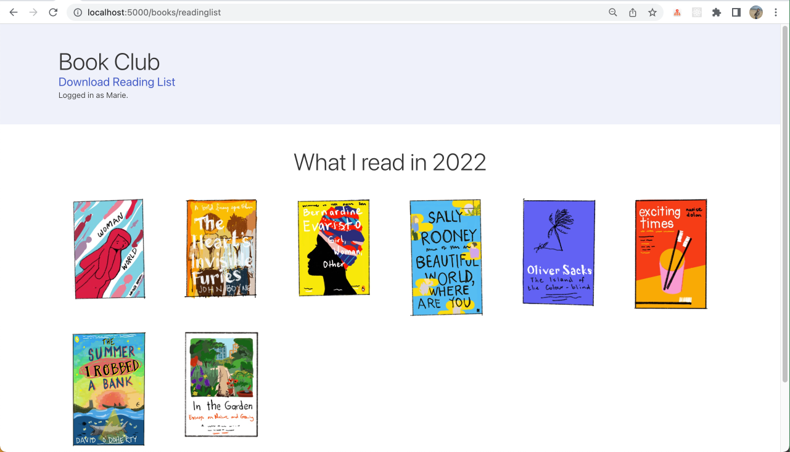

# Remote Book Club (RBC)

<p style="text-align: center;">
  
   &nbsp; &nbsp; 
     
</p>


## About

Personal project to practice using Node, Express and MongoDb. I have developed a simple website to host a remote book club, to help my friends and I keep track of what we are reading. Users can log in to add suggestions to the reading list, see the book selected each month or review the reading history. Inspired by [Reading Lists](http://www.abouttoday.co.uk/Reading-lists) by Lizzy Stewart, a layout-page has been added which contains a collection of all books read that year. 

Again inspired by Lizzy Stewarts reading lists, when suggesting a book to the group, I have included an option to link a file for the book cover image from google-drive, to allow memebers to contribute their own artwork / book cover images.




## Set up your own project locally

1. Fork this repository.
2. Clone your forked repository to your local machine.
3. Navigate to server directory and install Node.js dependencies:
   ```
   npm install
   ```
4. Connect to a new MongoDB Atlas database. Any MongoDB database would be suffice although MongoDB Atlas is recommended. Please go to the MongoDB Atlas website and create an account for easy installation.
Establish the connection in the 'App.js' file in the server directory.  
5. Start the server:
   ```
   npm start
   ```
6. Browse to [http://localhost:5000](http://localhost:5000)

* The website is designed for ipad / laptop viewing.

<br>

### Tech Stack

- [Node.js](https://nodejs.org/en/docs/guides/getting-started-guide/) JavaScript runtime environment.
- [Express](https://expressjs.com/) web framework for Node.js.
- [Nodemon](https://nodemon.io/) to reload the server automatically.
- [Handlebars](https://handlebarsjs.com/) for serverside rendering to generate the HTML.
- [MongoDB Atlas](https://mongoosejs.com) to store information in Cloud database.
- [Mongoose](https://mongoosejs.com) to model objects in MongoDB.
- [Bulma](https://bulma.io/documentation) for CSS styling the HTML.
- [Jest](https://jestjs.io/) to write and run unit tests.
- [ESLint](https://eslint.org) for linting.


Adding Handlebars template engine to the tech stack with Node.js and Express, allows me to create a Server Side Rendered (SSR) web application. The template for the webpage is defined and then, based on the current requirement and the query to the database, the template is populated with received content. The template engine generates the HTML on the server side and then this static rendered webpage is displayed in the browser.

<br>

### Functionality

- Users can sign up to the book club with en email address and a username.
- The username and email are unique.
- To view books, users can log in and see the reading history.
- To suggest a book for the group to read, users can log in and add a suggestion.

**MVP**

- User: See current book and discussion date
- User: Can see all previously selected books

**MVP user stories & wireframe**

```
As a RBC member
So that I can keep up with my reading
I would like to be able to see the current book and discussion date

As a RBC member
So that I can keep track of my reading
I would like to be able see all previous remote-book-club selected books
```


<br>

**Additional**<br>

- User: Sign up
- User: Log in
- User: Log out
- User: Add book suggestion
- User: Get reminder emails
- User: View a _Reading List_ layout of all books read.

**Additional user stories & wireframes**

```
As a RBC member
In order to interact with the application
I would like to be able to sign up

As a RBC member
So that I could access my account
I would like to be able to sign in

As a RBC member
So that I could keep my account secure
I would like to be able to sign out

As a RBC member
So that I can suggest a new book
I would like to be able to post my book suggestion

As a RBC member
So that I am kept up to date with my reading
I would like to recieve an email every time a new book is selected

As a RBC member
So that I don't miss a discussion
I would like to recieve an email reminder the morning of a book discussion with a link
```


<br>

## Work in progress screenshots

MVP achieved. Sign-in and log-in functions working. Using local MongoDB database currently. Can add book suggestion through form and select them as the next months book.

### Homepage


### Suggested books


### Add a book to suggestion list



### Reading List

