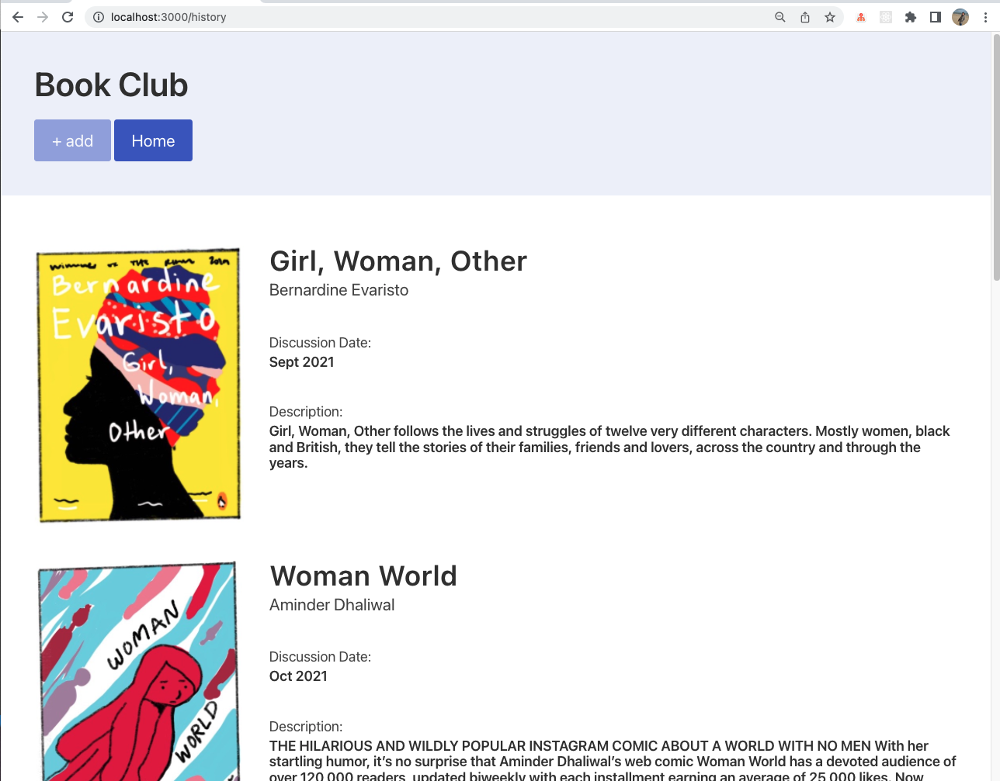

# Remote Book Club (RBC)

## About

A simple website to host a remote book club. Users can log in to add suggestions to the reading list, see the current book or review the reading history. Read me about how I started to built it [here](https://mmguinness.github.io/portfolio/portfolio/2022/05/12/Model-view-controller.html).

### Work in progress screenshot

Current status, MVP achieved(with hardcoded info):
- Homepage.

 

- All book details, history page.



### Tech Stack

- [Node.js](https://nodejs.org/en/docs/guides/getting-started-guide/) JavaScript runtime environment.
- [Express](https://expressjs.com/) web framework for Node.js.
- [Nodemon](https://nodemon.io/) to reload the server automatically.
- [Handlebars](https://handlebarsjs.com/) for serverside rendering to generate the HTML. [Reference](https://stackabuse.com/guide-to-handlebars-templating-engine-for-node/) tutorial. 
- [Bulma](https://bulma.io/documentation) for CSS styling the HTML.
- [Mongoose](https://mongoosejs.com) to model objects in MongoDB.
- [Jest](https://jestjs.io/) to write and run unit tests.
- [ESLint](https://eslint.org) for linting.


Adding Handlebars template engine to the tech stack with Node.js and Express, allows me to create a Server Side Rendered (SSR) web application. The template for the webpage is defined and then, based on the current requirement and the query to the database(hardcoded to start with), the template is populated with received content. The template engine generates the HTML on the server side and then this static rendered webpage is displayed in the browser. 


### Functionality

- You don't have to be logged in to see the reading history.
- Users can sign up to RBC with email and a username.
- The username and email are unique.
- In order to suggest a book, users can log in and add a suggestion.

**MVP**

- User: See current book and discussion date
- User: Can see all previously selected books

**MVP user stories & wireframe**

```
As a RBC member
So that I can keep up with my reading
I would like to be able to see the current book and discussion date

As a RBC member
So that I can keep track of my reading
I would like to be able see all previous remote-book-club selected books
```


<br>

**Additional**<br>

- User: Sign up
- User: Sign in
- User: Sign out
- User: Add book suggestion
- User: Get reminder emails

**Additional user stories & wireframes**

```
As a RBC member
In order to interact with the application
I would like to be able to sign up

As a RBC member
So that I could access my account
I would like to be able to sign in

As a RBC member
So that I could keep my account secure
I would like to be able to sign out

As a RBC member
So that I can suggest a new book
I would like to be able to post my book suggestion

As a RBC member
So that I am kept up to date with my reading
I would like to recieve an email every time a new book is selected

As a RBC member
So that I don't miss a discussion
I would like to recieve an email reminder the morning of a book discussion with a link
```


